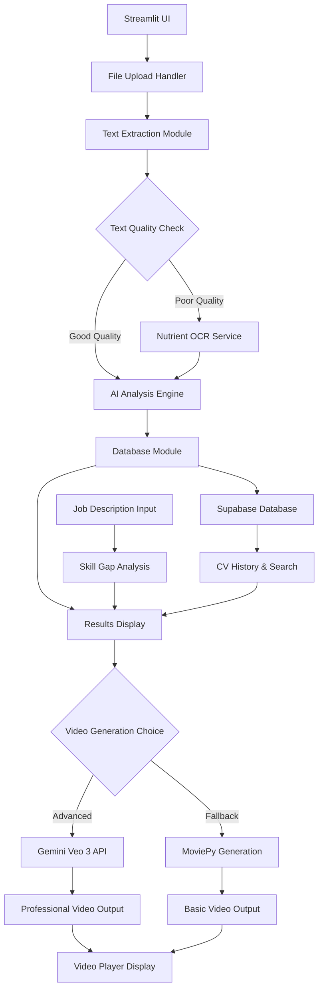

# Design Document

## Overview

The AI-Powered Resume Analyzer is built as a Streamlit web application with a modular Python backend. The system follows a pipeline architecture where resume files flow through text extraction, AI analysis, and video generation stages. The design prioritizes rapid development for hackathon constraints while maintaining code modularity for team collaboration.

## Architecture

### High-Level Architecture



### Component Architecture

The system is organized into six main modules:

1. **app.py** - Streamlit UI and orchestration
2. **parsing.py** - Document text extraction
3. **ai_integration.py** - OpenAI API integration and analysis
4. **tts_video.py** - Audio synthesis and video generation (fallback)
5. **database.py** - Supabase database integration and CV storage
6. **gemini_video.py** - Gemini Veo 3 API integration for advanced video generation

## Components and Interfaces

### Text Extraction Module (parsing.py)

**Core Functions:**
- `extract_text_pdf(file_path: str) -> str`
- `extract_text_docx(file_path: str) -> str`
- `needs_nutrient_ocr(text: str) -> bool`
- `call_nutrient_ocr(file_path: str, api_key: str) -> str`

**Design Decisions:**
- Primary extraction uses pdfplumber and python-docx for speed and offline capability
- Nutrient OCR serves as fallback for complex layouts or scanned documents
- Text quality assessment based on character density, formatting artifacts, and readability metrics
- Multipart form data for Nutrient API integration

### AI Analysis Engine (ai_integration.py)

**Core Functions:**
- `call_gpt_analysis(resume_text: str, job_text: str = "") -> dict`
- `generate_pitch_script(analysis_data: dict) -> dict`
- `score_resume_vs_job(resume_skills: list, job_skills: list) -> dict`

**GPT Integration Design:**
- Uses OpenAI Chat Completions API with system/user message pattern
- Structured JSON response format with strict schema validation
- Retry logic with exponential backoff for API failures
- Language auto-detection for English/Romanian support

**Prompt Engineering:**
- System message enforces JSON-only responses
- User message includes resume text and optional job description
- Specific instructions for extracting strengths, weaknesses, skills, and pitch content
- Response validation and JSON parsing with error handling

### Database Module (database.py)

**Core Functions:**
- `init_supabase_client() -> Client`
- `store_cv_analysis(resume_text: str, analysis_data: dict, metadata: dict) -> str`
- `get_cv_history(user_id: str = None, limit: int = 50) -> list`
- `search_cvs(query: str, filters: dict = None) -> list`
- `update_cv_record(cv_id: str, updates: dict) -> bool`

**Technical Approach:**
- Supabase Python client for database operations
- PostgreSQL database with optimized schema for CV data
- Row-level security for data privacy
- Full-text search capabilities for CV content
- Automatic timestamps and metadata tracking

### Gemini Video Generation Module (gemini_video.py)

**Core Functions:**
- `init_gemini_client() -> GenerativeModel`
- `generate_video_with_gemini(script_data: dict, style_preferences: dict) -> str`
- `check_generation_status(job_id: str) -> dict`
- `download_generated_video(video_url: str, output_path: str) -> bool`

**Technical Approach:**
- Google Gemini Veo 3 API integration
- Advanced AI-powered video generation with professional templates
- Asynchronous video processing with status polling
- Customizable video styles and branding options
- Automatic fallback to moviepy if API unavailable

### Video Generation Module (tts_video.py) - Fallback

**Core Functions:**
- `synthesize_audio(text: str, output_path: str, language: str = "en") -> None`
- `create_animated_slides(script_parts: dict, duration: float = 10.0) -> list`
- `make_video(audio_path: str, script_parts: dict, output_path: str) -> None`

**Technical Approach:**
- Serves as fallback when Gemini Veo 3 is unavailable
- edge-tts for high-quality text-to-speech synthesis
- moviepy for video composition and animation
- Time-synchronized text animations with fade transitions
- H.264 encoding for browser compatibility

### Streamlit UI (app.py)

**Layout Design:**
- Sidebar: File upload, job description input, action buttons
- Main area: Tabbed interface for extracted text, analysis results, and video player
- Progress indicators for long-running operations
- Download buttons for generated content

**User Experience Flow:**
1. Upload resume file
2. Display extracted text (collapsible)
3. Show AI analysis with formatted results
4. Optional job description comparison
5. Generate and display video pitch
6. Download options for results

## Data Models

### Supabase Database Schema

```sql
-- CV Records Table
CREATE TABLE cv_records (
  id UUID PRIMARY KEY DEFAULT gen_random_uuid(),
  user_id UUID REFERENCES auth.users(id),
  filename VARCHAR(255) NOT NULL,
  original_text TEXT NOT NULL,
  extracted_at TIMESTAMP WITH TIME ZONE DEFAULT NOW(),
  file_type VARCHAR(10) NOT NULL,
  file_size INTEGER,
  language VARCHAR(5) DEFAULT 'en',
  created_at TIMESTAMP WITH TIME ZONE DEFAULT NOW(),
  updated_at TIMESTAMP WITH TIME ZONE DEFAULT NOW()
);

-- Analysis Results Table
CREATE TABLE analysis_results (
  id UUID PRIMARY KEY DEFAULT gen_random_uuid(),
  cv_id UUID REFERENCES cv_records(id) ON DELETE CASCADE,
  strengths JSONB NOT NULL,
  weak_points JSONB NOT NULL,
  suggestions JSONB NOT NULL,
  top_skills TEXT[] NOT NULL,
  one_sentence_pitch TEXT NOT NULL,
  compatibility_score INTEGER,
  missing_skills TEXT[],
  matching_skills TEXT[],
  analyzed_at TIMESTAMP WITH TIME ZONE DEFAULT NOW()
);

-- Video Generation Records Table
CREATE TABLE video_records (
  id UUID PRIMARY KEY DEFAULT gen_random_uuid(),
  cv_id UUID REFERENCES cv_records(id) ON DELETE CASCADE,
  video_url TEXT,
  generation_method VARCHAR(20) NOT NULL, -- 'gemini' or 'moviepy'
  script_data JSONB NOT NULL,
  style_preferences JSONB,
  status VARCHAR(20) DEFAULT 'pending', -- 'pending', 'processing', 'completed', 'failed'
  gemini_job_id VARCHAR(255),
  generated_at TIMESTAMP WITH TIME ZONE DEFAULT NOW()
);

-- Indexes for performance
CREATE INDEX idx_cv_records_user_id ON cv_records(user_id);
CREATE INDEX idx_cv_records_created_at ON cv_records(created_at DESC);
CREATE INDEX idx_analysis_results_cv_id ON analysis_results(cv_id);
CREATE INDEX idx_video_records_cv_id ON video_records(cv_id);
CREATE INDEX idx_video_records_status ON video_records(status);

-- Full-text search index
CREATE INDEX idx_cv_records_text_search ON cv_records USING gin(to_tsvector('english', original_text));
```

### Analysis Result Schema

```json
{
  "strengths": [
    {
      "text": "Strong leadership experience",
      "evidence": "Led team of 15 developers on major project"
    }
  ],
  "weak_points": [
    {
      "text": "Vague job descriptions",
      "location": "Work Experience section",
      "reason": "Lacks specific metrics and achievements"
    }
  ],
  "suggestions": [
    {
      "for": "Vague job descriptions",
      "suggestion": "Add specific metrics like 'Increased team productivity by 25%'"
    }
  ],
  "top_skills": ["Python", "Machine Learning", "Team Leadership"],
  "one_sentence_pitch": "Hi, I'm John Smith, a Python developer with machine learning expertise and proven team leadership skills."
}
```

### Video Script Structure

```json
{
  "intro": {
    "text": "Hi, I'm John Smith",
    "start_time": 0.0,
    "duration": 2.0
  },
  "skills": {
    "text": "Python, Machine Learning, Team Leadership",
    "start_time": 2.0,
    "duration": 4.0
  },
  "achievement": {
    "text": "Led 15-person development team",
    "start_time": 6.0,
    "duration": 3.0
  },
  "closing": {
    "text": "Let's connect!",
    "start_time": 9.0,
    "duration": 1.0
  }
}
```

## Error Handling

### Text Extraction Errors
- PDF corruption: Fallback to Nutrient OCR
- DOCX format issues: Error message with format requirements
- Empty extraction: User notification and re-upload option

### AI Integration Errors
- API rate limits: Exponential backoff retry
- Invalid JSON responses: JSON extraction from text with regex
- Network failures: User-friendly error messages with retry options

### Video Generation Errors
- TTS failures: Fallback to alternative voice or text display
- Video encoding issues: Simplified animation fallback
- Audio/video sync problems: Duration adjustment algorithms

## Testing Strategy

### Unit Testing Approach
- **parsing.py**: Test with sample PDFs/DOCX files, mock Nutrient responses
- **ai_integration.py**: Mock OpenAI API calls, test JSON parsing edge cases
- **tts_video.py**: Test audio generation and video composition with known inputs

### Integration Testing
- End-to-end flow with sample resumes
- API integration testing with rate limiting
- File upload and download functionality

### Performance Considerations
- Async processing for long-running operations
- Progress indicators for user feedback
- Caching for repeated API calls
- Video compression for faster loading

## Security and Privacy

### API Key Management
- Environment variables for all API keys
- .env file template with placeholder values
- No hardcoded credentials in source code

### Data Handling
- Temporary file cleanup after processing
- Secure storage of CV data in Supabase with encryption
- Row-level security for user data privacy
- Automatic backups and disaster recovery

## Deployment Considerations

### Local Development
- Simple pip install from requirements.txt
- Streamlit run command for immediate startup
- Cross-platform compatibility (Windows, macOS, Linux)

### Hackathon Demo Setup
- Single command startup script (run.sh)
- Pre-loaded sample data for quick demonstrations
- Offline fallback options where possible

## Technology Stack Rationale

### Streamlit Choice
- Rapid UI development for hackathon timeline
- Built-in file upload and media display components
- Easy deployment and sharing capabilities

### OpenAI GPT Integration
- High-quality natural language analysis
- JSON response formatting capability
- Multi-language support for English/Romanian

### edge-tts Selection
- High-quality voice synthesis
- Multiple language support
- Free and offline-capable option

### moviepy for Video Generation
- Python-native video processing
- Programmatic animation control
- Good documentation and community support